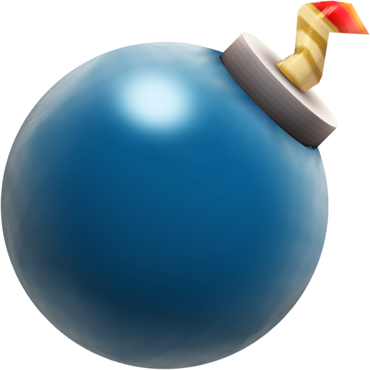
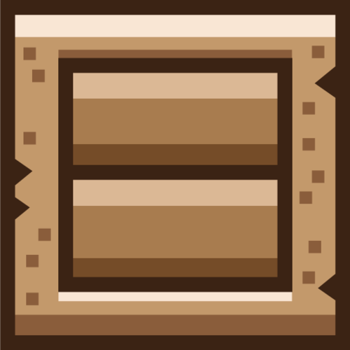
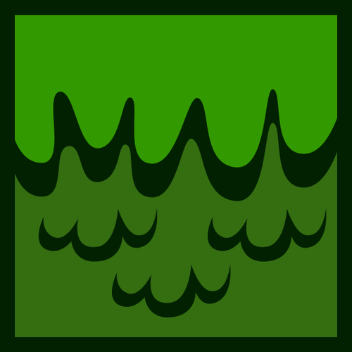
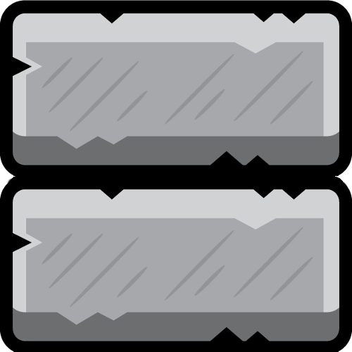

# Racer

Simple 2D platformer game

## Installation

Add this line to your application's Gemfile:

```ruby
gem 'racer'
```

And then execute:

    $ bundle

Or install it yourself as:

    $ gem install racer

## Usage

Start game by typing:

    $ racer 

## Controls

|  Key   |  Action |
|--------|---------|
|  Left  |  Move left  |
|  Right  |  Move right  |
|  Space  |  Jump  |
|  S  |  Use pause item  |
|  D  |  Use bomb  |
|  F  |  Use ruby (ruby is used automatically when the player is rolled out of screen)  |
|  P  |  Pause game  |
|  O  |  Unpause game  |

## Items

### Ruby

 - Teleport to the last floor
 - Slow down rolling
 


### Bomb

 - Blows up few blocks under the player
 


### Pause

 - Pause rolling for 4s
 


### Coin

 - Increase your score by amount of points equal to 10s of rolling on the highest speed

## Blocks

### Wood block

 - Destructible, normal speed
 


### Mossy block

 - Destructible, Slow down (75% speed)
 


### Brick block

 - Inestructible, Speed up (125% speed)
 


## Development

After checking out the repo, run `bin/setup` to install dependencies. You can also run `bin/console` for an interactive prompt that will allow you to experiment.

To install this gem onto your local machine, run `bundle exec rake install`. To release a new version, update the version number in `version.rb`, and then run `bundle exec rake release`, which will create a git tag for the version, push git commits and tags, and push the `.gem` file to [rubygems.org](https://rubygems.org).


## License

The gem is available as open source under the terms of the [MIT License](http://opensource.org/licenses/MIT).

